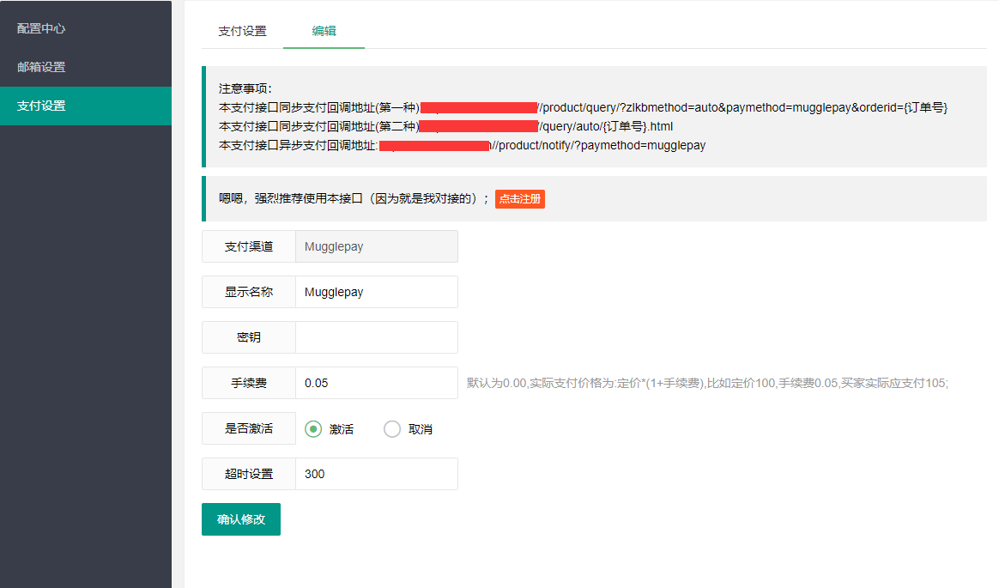

# MugglePay
### 特点
 - 支持多种主流数字货币：BTC、BTC（Lightning Network）、ETH、USDT、BCH、LTC、EOS
 - 五分钟完成对接
 - 手续费低至0%
## 注册地址 
 * [MugglePay.com](https://merchants.mugglepay.com/user/register?ref=MP38158552)
 
## 使用说明
 * 将文件覆盖到ZFAKA根目录即可 
 * 如果你更改过ZFAKA的登陆地址，请自行修改/application/modules/Admin/views/payment/tpl/  路径中的Admin为你的自己的目录名称
 * 修改数据库，在faka数据库中运行下面的sql语句，建议使用宝塔环境的phpmyadmin软件进行修改，省时省力 
 *  ```sql
    INSERT INTO `t_payment` (`payment`, `payname`, `payimage`, `alias`, `sign_type`, `app_id`, `app_secret`, `ali_public_key`, `rsa_private_key`, `configure3`, `configure4`, `overtime`, `active`) VALUES
    ('Mugglepay', 'Mugglepay', '/res/images/pay/crypto.png', 'Mugglepay', 'MD5', '', '', '', '', '', '0.00', 300, 0);
    ```
## 注册流程
 1. 先跟点击上方注册地址，使用邀请码  MP38158552  注册
 2. 注册登录[商家后台](https://merchants.mugglepay.com)
 3. 选择"开发者中心"->“密钥管理”->“用在后台服务器（SSP等php后台）”，点击“添加密钥”，获得应用密钥。将获取的应用密钥，填入ZFAKA 支付方式配置文件中。


 4. 将获取的应用密钥，填入ZFAKA 支付方式配置中的 "密钥" 处， 手续费请自行设置


## 认证审核
 请去"产品中心"-->"产品功能"，完成权限开通<br />
 
 请确认您已经开通了需要的权限。
 注意，如果你只有 “加密货币”，那只能接受加密货币。如需要开通其他支付方式，请按照该页面的流程操作。

## FAQ
可以参考数字货币匿名支付[常见问题](https://github.com/MugglePay/MugglePay/blob/master/README-CN.md)。
如果支付遇到问题，可以联系[技术交流群](https://t.me/mugglepay)。